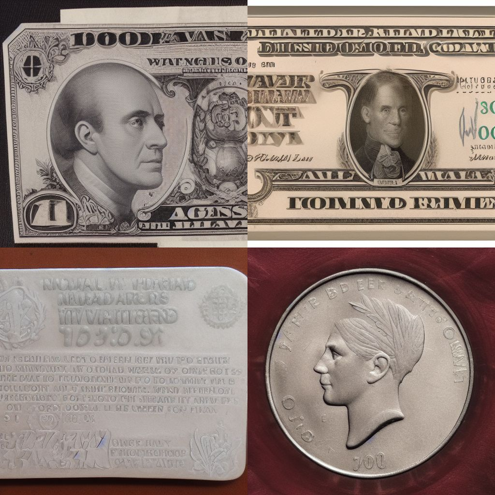

# Embedding-mixer version 0.33

Similar to Embedding Inspector, more powerful but not user-friendly, text-only, for advanced users. Not tested, provided as-is.

# Formula examples

---
	emb('cat')		# retrieves the vector of internal embedding 'cat</w>'
	emb('#2368')	# same as above, but with its ID
	emb('mdjrny-ppc')	# retrieves this loaded embedding (may contain multiple vectors)

	# mix embeddings by adding their vector values (if vector counts differ, pad with zeros)
	mix ( emb('cat') * 0.6 , emb('astronaut') * 0.7 ) 
	
	# concatenate embeddings by stacking their vectors
	concat( emb('mona')*0.3 , emb('lisa')*0.3 , emb('wearing'), emb('sunglasses') ) 

	# reduce embedding to 1-vector by summing all of its vectors
	reduce( emb('mdjrny-ppc') )  

	# extract vector2 from the embedding
	extract(  emb('mdjrny-ppc') , [2] ) 

	# remove vectors 3 and 5 from the embedding
	remove(  emb('mdjrny-ppc') , [3,5] ) 
	
	# evaluate and apply this eval string on the embedding
	process ( emb('cat'), '=(1*(v>=0)-1*(v<0))/50' ) 

	# example of a compound formula
	mix ( process(emb('cat'),'=v*(i<300)') , process(emb('dog'),'=v*(i>=300)') )

	# scale magnitude to 1
	process(  emb('cat')  , '=v/vec_mag')
	
	# keep n maximum/minimum values in vector, zero others
	keepabsmax( emb('elephant'), 100) 
	mix( keepmax( emb('elephant'), 50) , keepmin( emb('elephant'), 50) )

	# find most similar embedding to a unit vector
	mostsimilar( process( torch.zeros(768) , '=(i==300)' ) )

	# create random embedding
	torch.randn(768)/50

	# load tensor saved by inspector
	torch.tensor([[ 1.2886e-02, -7.1144e-03, -6.7101e-03, -3.5076e-03,  6.6986e-03, ......... ]])

---

The functions above can be combined to create complex formulas.
Log will show function calls, but not all operations, as the string is parsed by python itself.
You can copy the formula from the text box, and save it for later use.

Eval string usage is the same as Embedding inspector.

note: vector size is 768 for SD1 and 1024 for SD2, different vector sizes can not be intermixed.

# Run script feature:

---

    global result_str, name1, name2, weight1, weight2
    step_str = ''
    overwrite = True
    fnams = []
    for n in range(5):
        name1 ='chicken'
        name2 ='dinosaur'
        weight1 = n/5
        weight2 = 1-n/5
        fnam = 'test'+str(n)
        fnams.append(fnam)
        formula_str = "emb(name1)*weight1+emb(name2)*weight2"
        do_save(step_str, formula_str , fnam, overwrite, frombatch=True)
    result_str = '\n'.join(fnams)

---

log and graph may not be updated but running the above script will save 5 embeddings.

---

    global result_str, boost, ipeak
    step_str = ''
    overwrite = True
    fnams = []
    for n in range(310,320):
        boost = 6
        ipeak = n
        fnam = 'dim'+str(n)
        fnams.append(fnam)
        formula_str = "process( torch.zeros(768), '=boost*(i==ipeak)' ) "
        do_save(step_str, formula_str , fnam, overwrite, frombatch=True )
    result_str = '\n'.join(fnams)

---

above script will save 10 embeddings which contain unit vectors 310 to 320. (What I call unit vector is when all 768 values are zero except one dimension. I found that a magnitude of ~6 is needed for such embeddings to work.) With this I'm trying to understand what each value is doing, for example I found that unit vector 319 consistently generates coin/money images, 418 some football images, etc. Also 75 seems to be 'cat dimension'

  
